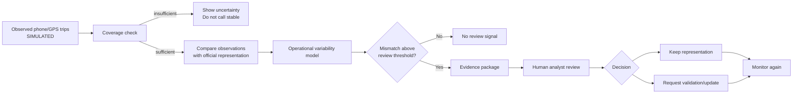
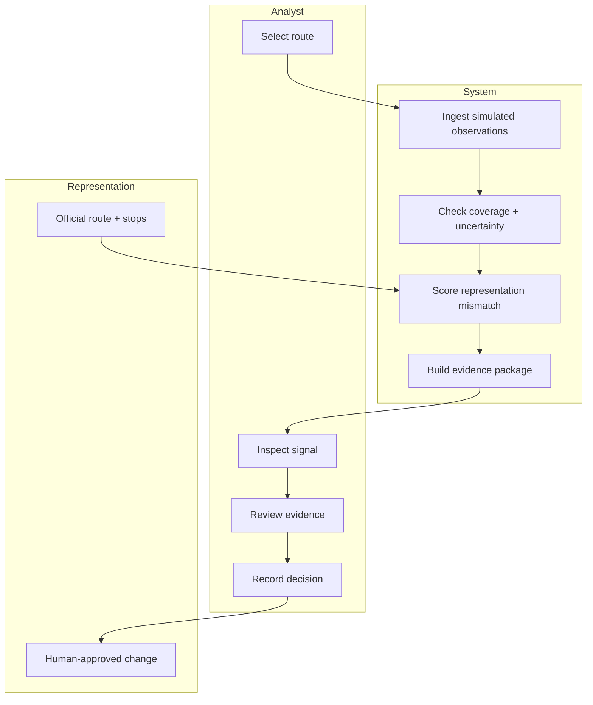

# BUSINESS BENDING WEEK 07 — PACKET
## The Holy Driver — Operational Change Evidence Layer

**Operator / role:** Regina — TECHNOLOGIST

## 1. Problem in my words

CDMX already has official mobility representations, including GTFS and a maintained dataset of routes and stops for concessioned transport. The unresolved question is narrower: **do existing observations provide enough coverage to distinguish normal operational variability from a meaningful operational change that deserves human review?**

I am not claiming that a technology vacuum exists. I am testing whether there is a **data-coverage and workflow-efficiency gap**. If SEMOVI already has enough information and its current workflow performs adequately, the technology vacuum is killed.

## 2. Exact user

**Primary user:** a SEMOVI mobility-data / service-information analyst responsible for reviewing evidence before a route or stop representation is changed.

The system is an internal decision-support slice. It does not publish an official route, sanction a driver, identify a person, or update the public dataset automatically.

## 3. Success definition

> **Before the module closes, an analyst can select a simulated concessioned route, run an analysis, see whether observation coverage is sufficient, inspect a representation-mismatch signal against the official route, review an evidence package, and record a human decision — without the system pretending that the change is already official.**

## 4. Working slice

The MVP produces one output:

> **Potential representation mismatch — sufficient coverage — review recommended.**

The signal combines:

- simulated phone/GPS telemetry (clearly labeled simulated);
- the current official representation;
- geospatial comparison of observed paths vs. the represented path;
- an ML-style anomaly score using a deterministic, explainable scoring function for the demo;
- coverage and uncertainty checks;
- an evidence package containing observations, time window, mismatch score, and recommended human review.

### Safety / scope boundary

- No automatic route update.
- No automatic enforcement or sanctions.
- No driver identification.
- No personal data.
- No claim that a mismatch is necessarily unsafe.
- No claim that the experiment proves a technology vacuum.

## 5. Benchmark line

**Best existing solution on Earth:** Mobileye REM is a strong benchmark for continuously collecting vehicle observations, aggregating/aliging trajectories, modeling road infrastructure, and detecting map change at scale.

**Mine differs/localizes by:** this slice tests the narrower institutional handoff for CDMX concessioned transit: **coverage → representation mismatch → evidence package → human review**, rather than building another global map.

## 6. Long-view (3 years)

If this slice works, the full product becomes an institutional change-management layer for mobility representations. It continuously evaluates whether observed operation still matches the official representation and packages evidence for accountable human review. The product succeeds only if it measurably reduces validation time or cost without reducing decision quality; otherwise it should not be built.

## 7. Architecture + stack

| Layer | Choice | Purpose |
|---|---|---|
| UI | Next.js + React + Tailwind | Analyst dashboard |
| Geodata | GeoJSON-style route geometry + SVG map | Represent official and observed paths |
| Telemetry | Simulated phone/GPS observations | Demonstration input, explicitly labeled |
| ML | Deterministic anomaly / mismatch scoring | Reproducible experiment without opaque AI claims |
| API | Next.js route handlers | Analysis endpoint if needed later |
| Data | Static demo dataset for this slice | No personal data, no production dependency |
| Deploy | Vercel | Live demo |
| Source | GitHub | Versioned commits |

## 8. Flow

### Swimlane

## 9. Visual mockup

The repository includes `docs/mockup.svg`, a generated low-fidelity visual specification of the analyst screen. It shows the route map, coverage state, mismatch signal, evidence package, and review action in one screen.

## 10. Test plan

### Mechanical pass

1. Load the live dashboard.
2. Confirm the simulated-data warning is visible.
3. Select the demo route.
4. Run analysis.
5. Confirm coverage, mismatch score, map traces, and evidence package appear.
6. Trigger the insufficient-coverage state.
7. Confirm the UI says **unknown / insufficient coverage**, not stable.
8. Record a human decision.
9. Redeploy after fixing at least one issue.

### Persona pass

Synthetic persona: **Doña Mari, 54, food seller near a metro station, uses WhatsApp but distrusts apps, reads slowly, and gives up silently when confused.** The product is primarily for an institutional analyst, so this persona is used as a comprehension stress-test rather than as the target buyer. The analyst flow must still make the key distinction — signal vs. official change — immediately understandable.

### Experiment metrics

- observation coverage;
- mismatch precision/recall on labeled simulated scenarios;
- false positives / false negatives;
- lead time;
- time to human validation;
- validation cost;
- decision quality.

## 11. Kill condition

If an 8-week comparison shows that SEMOVI already has sufficient information to detect and validate changes and the current workflow performs adequately, **kill the data-coverage vacuum**. Keep only a workflow-automation hypothesis if the experimental layer demonstrates meaningful time or cost savings with no reduction in decision quality.

## 12. Evidence status

**Established by external evidence:** CDMX publishes a static GTFS feed with routes, trips, frequencies, shapes, stops and stop times; SEMOVI's concessioned-route/stop dataset is maintained and was updated in September 2026; GTFS defines a Schedule/Realtime split; Mobileye REM demonstrates large-scale map change detection.

**Inference:** there may still be a coverage/decision-workflow gap for concessioned transit.

**Not yet proven:** that the gap exists at meaningful scale, that reducing it changes an institutional decision, or that it has a measurable safety effect.
