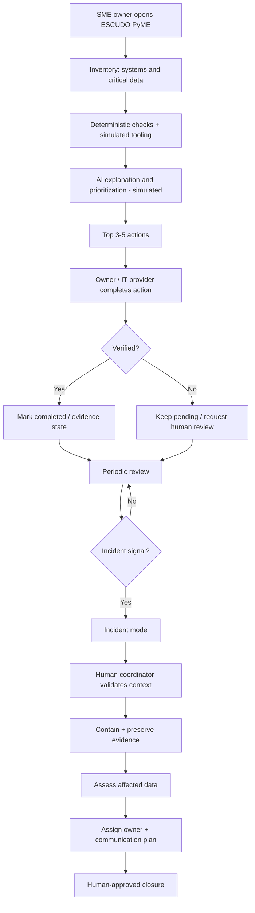
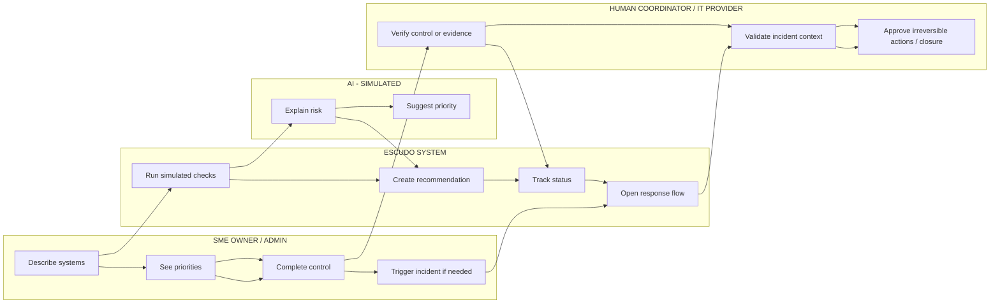

# BUSINESS BENDING · WEEK 08 — PACKET.md
## ESCUDO PyME

**Role:** TECHNOLOGIST  
**Product:** ESCUDO PyME  
**Working slice:** readiness + simulated incident-response workflow for a synthetic Mexican dental clinic.

## 1. Problem in my own words

Mexican SMEs can already access many cybersecurity controls, but a small business without an internal security team can still struggle to know what matters first, prove that a protection is actually in place, and respond in an organized way when something goes wrong. The product opportunity is not another antivirus or detection engine. It is a simple operational layer that turns existing controls into prioritized, verifiable actions and gives the business a clear human response path during an incident.

## 2. Exact user

**Primary user:** owner/administrator of a small Mexican dental clinic with 2–3 locations, 15–30 employees, patient records, email, cloud files, and a third-party IT provider, with no internal cybersecurity team.

**Operational partner:** the clinic's IT provider, because that person is likely to receive the first technical call or detect the first signal. A named human coordinator remains responsible for escalation and irreversible decisions.

All demo data is synthetic.

## 3. Success definition

Before the module closes, a non-security SME owner can see the top security actions, understand the first action in plain Spanish, distinguish recommendation from verified state, trigger a simulated incident, identify the next owner and severity, find the human escalation path, and complete the simulated flow without the interface implying that AI guarantees safety.

## 4. Product flow

## 5. Swimlane

## 6. Benchmark

**Best existing pattern:** managed security for SMEs plus a verifiable security baseline.  
**Mine differs/localizes by:** Spanish-first, phone-first, Mexican SME context, and a single workflow connecting prevention, verification and human incident response instead of another scanner.

## 7. Long view

If this slice works, ESCUDO PyME becomes a low-cost operating layer for SME cyber readiness. Incident mode can become a coordinated response service delivered through local IT providers and approved specialists, with explicit capacity and escalation rules. It can later support continuity, insurance or compliance conversations without pretending AI alone makes a company safe.

## 8. Scope cut

No antivirus, password manager, autonomous attacker detection, ransom payment, attacker contact, automatic notification decision, safety certification, credential collection, real personal data, or autonomous irreversible action.

## 9. Architecture + stack

| Layer | MVP |
|---|---|
| UI | Static HTML/CSS/JS |
| LLM | Simulated Spanish explanation/prioritization |
| Security layer | Simulated MFA/backup/access/device/provider checks |
| Third stack | Simulated incident dataset + workflow automation |
| Data | In-memory/browser state only |
| Hosting | Vercel |
| Auth | Not required for synthetic non-persistent demo |

## 10. Test plan

Mechanical pass: test navigation, controls, incident progression, labeling, and synthetic-data safeguards; document and fix one usability issue before final deployment.

Persona pass: **Doña Mari, 54**, small dental-clinic owner, WhatsApp user, distrusts complex apps, reads slowly and gives up silently when confused. She must identify the first action, distinguish recommendation from verification, trigger an incident and identify the human escalation path without technical help.

## 11. Safety / shadow clause

AI recommends; a human or deterministic check verifies. AI never pays a ransom, contacts an attacker, decides whether to notify affected people, certifies safety, or marks a control verified. Irreversible actions require a named human. All demo data is invented.

## 12. Kill conditions

Kill or redesign if users interpret simulated AI as a guarantee, cannot identify the human escalation path, the workflow adds confusion, sensitive information must be stored to demonstrate value, or there is no measurable continuity/response benefit for an SME.
